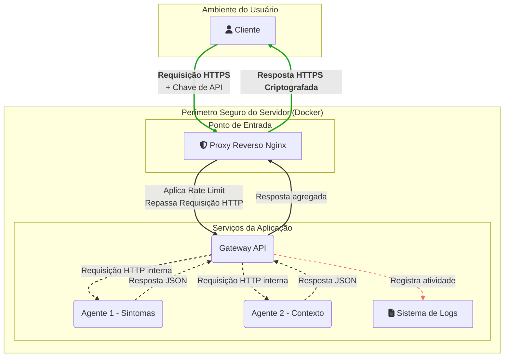

### 4.3. Visão Final (Pós-Implementação das Mitigações)

Após a análise de ameaças, a arquitetura foi revisada para incorporar as medidas de mitigação. A principal mudança foi a introdução de um **Proxy Reverso (Nginx)** como ponto de entrada do sistema.

O Nginx é responsável por:
1.  **Terminação SSL/TLS:** Ele gerencia a criptografia HTTPS, descriptografando a requisição do cliente e a repassando para o Gateway via HTTP na rede interna segura do Docker.
2.  **Rate Limiting:** Aplica a política de limitação de requisições.
3.  **Gateway de API:** Atua como o único ponto de entrada, escondendo os detalhes da infraestrutura interna.

**Diagrama da Arquitetura Final:**

**Observação:** Os diagramas acima utilizam a sintaxe Mermaid e podem ser renderizados diretamente pelo GitHub em arquivos `.md`. Eles usam ícones do Font Awesome, que também são suportados.