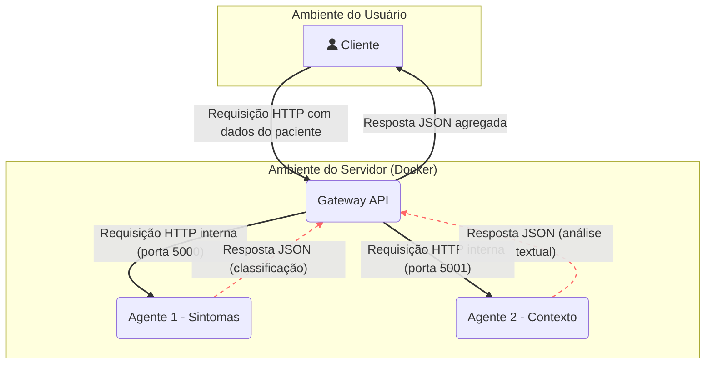

## 4. Documentação Arquitetônica

Esta seção detalha a evolução da arquitetura do sistema, desde sua concepção inicial até a versão final com medidas de segurança implementadas.

### 4.1. Visão Inicial (Pré-Modelagem de Ameaças)

A arquitetura inicial foi projetada para validar a funcionalidade principal do sistema: a orquestração de múltiplos agentes de IA através de um gateway central.

Nesta visão, os três microserviços (`agente1`, `agente2` e `gateway`) são orquestrados pelo Docker Compose. Um cliente (usuário final) faz uma requisição HTTP diretamente para o Gateway, que por sua vez consulta os dois agentes na rede interna do Docker e agrega as respostas.

**Diagrama da Arquitetura Inicial:**

**Pontos Fracos Identificados nesta Visão:**
* A comunicação é feita via HTTP, sem criptografia.
* Não há controle de acesso; qualquer um pode chamar a API.
* O sistema está vulnerável a ataques de negação de serviço (DoS).
* Não há registro de atividades para auditoria.